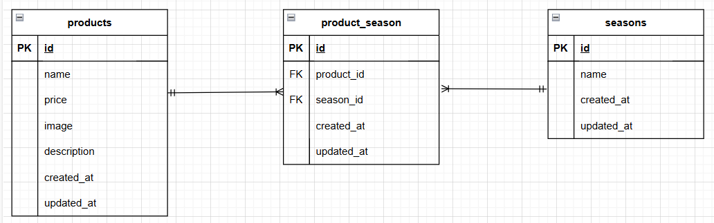

# もぎたて　　

## 環境構築

#### Docker ビルド

1.git@github.com:kenta-10043/frima-mogitate.git  
2.docker-compose up -d --build

\*MySQL は、OS によって起動しない場合があるのでそれぞれの PC に合わせて docker-compose.yml ファイルを編集してください。

Laravel 環境構築

1.Docker の設定　(docker-compose exec php bash)  
2.Laravel のパッケージのインストール　(composer install)  
3.env.example ファイルから.env を作成し、環境変数を変更　(cp .env.example .env)  
 |設定項目|変更前|変更後|  
 |---|---|---|  
 |DB_HOST|127.0.0.1|mysql|  
 |DB_DATABASE|laravel|laravel_db|  
 |DB_USERNAME|root|laravel_user|  
 |DB_PASSWORD|ー|laravel_pass| 
 
4.アプリケーションキーの作成　(php artisan key:generate)  
5.マイグレーションの実行　(php artisan migrate)  
6.シーディングの実行　(php artisan db:seed)

## 使用技術

- PHP 8.3-fpm
- Laravel 10.0
- MySQL 8.0.26

## ER 図

## URL

- 開発環境：http://localhost/
- phpMyAdmin：http://localhost:8080/
